<!--
████████╗ █████╗  ██████╗██╗ █████╗ ███╗   ██╗ █████╗
╚══██╔══╝██╔══██╗██╔════╝██║██╔══██╗████╗  ██║██╔══██╗
   ██║   ███████║██║     ██║███████║██╔██╗ ██║███████║
   ██║   ██╔══██║██║     ██║██╔══██║██║╚██╗██║██╔══██║
   ██║   ██║  ██║╚██████╗██║██║  ██║██║ ╚████║██║  ██║
   ╚═╝   ╚═╝  ╚═╝ ╚═════╝╚═╝╚═╝  ╚═╝╚═╝  ╚═══╝╚═╝  ╚═╝
   MARINOS — NEUROTECHLABS // README v3.0
-->

<!-- ═══════════════════════════════════════════════════════
     BANNER HEADER
════════════════════════════════════════════════════════ -->
<p align="center">
  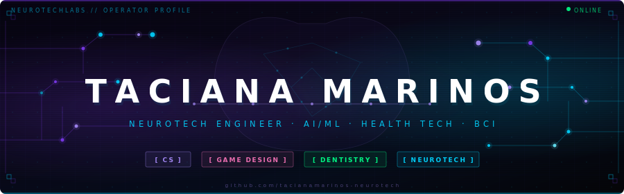
</p>

<!-- ═══════════════════════════════════════════════════════
     TYPING ANIMATION
════════════════════════════════════════════════════════ -->
<p align="center">
  
</p>

<!-- ═══════════════════════════════════════════════════════
     SOCIAL BADGES
════════════════════════════════════════════════════════ -->
<p align="center">
  <a href="https://www.linkedin.com/in/taciana-marinos-ramalho-04028373" target="_blank">
    
  </a>
  &nbsp;
  
  &nbsp;
  
  &nbsp;
  
</p>

<br/>

---

<!-- ═══════════════════════════════════════════════════════
     WHOAMI — TERMINAL BLOCK
════════════════════════════════════════════════════════ -->

```
╔══════════════════════════════════════════════════════════════════╗
║  NEUROTECHLABS // SECURE TERMINAL v2.4.1                         ║
║  INITIALIZING NEURAL INTERFACE...                                ║
╠══════════════════════════════════════════════════════════════════╣
║  OPERATOR  : TACIANA MARINOS                                     ║
║  ROLE      : NEUROTECH ENGINEER · DENTIST · CS · GAME DESIGN     ║
║  STATUS    : ACTIVE — BUILDING HUMAN-MACHINE INTERFACES          ║
║  LOCATION  : BRAZIL 🇧🇷 → GLOBAL 🌐                              ║
╚══════════════════════════════════════════════════════════════════╝
```

```yaml
whoami:
  name:     "Taciana Marinos"
  title:    "NeuroTech Innovator · Dentist · CS Engineer · Game Designer"
  org:      "NeuroTech/Labs"

journey:
  - "💻 Computer Science  →  built the logic, the systems, the architecture"
  - "🎮 Game Design       →  mastered human interaction and immersive experience"
  - "🦷 Dentistry         →  understood the human body from the inside"
  - "🧠 NeuroTech + AI    →  unified everything into one convergent vision"

philosophy: >
  "Every path I took was a deliberate layer.
   Not a pivot — a convergence."

current_focus:
  - "Machine Learning applied to health & neural data"
  - "Brain-Computer Interfaces (BCI) + EEG signal processing"
  - "AI-powered dental diagnostics"
  - "Human-Machine interaction design"

superpower: "I speak Biology, Code, Design AND Medicine — fluently."
```

---

<!-- ═══════════════════════════════════════════════════════
     THE CONVERGENCE
════════════════════════════════════════════════════════ -->

## `> CONVERGENCE`

```
  [CS]           →  mastered logic, systems, architecture
  [GAME DESIGN]  →  learned how humans interact with machines
  [DENTISTRY]    →  understood the human body from within
  [NEUROTECH]    →  unified everything into one vision

  // This is not a pivot. This is a convergence.
```

| 🧠 NeuroTech | 🤖 AI & ML | 🦷 Health Tech | 🎮 Immersive UX |
|:---:|:---:|:---:|:---:|
| BCI · EEG · Neural Interfaces | Deep Learning · Medical Imaging | AI Diagnostics · FHIR · Digital Health | Game Design Principles in Medical UX |

---

<!-- ═══════════════════════════════════════════════════════
     NEURAL COMPETENCE MAP — NETWORK DIAGRAM
════════════════════════════════════════════════════════ -->

## `> NEURAL COMPETENCE MAP`

```
SYSTEM: MAPPING COMPETENCE NODES...
```

<p align="center">
  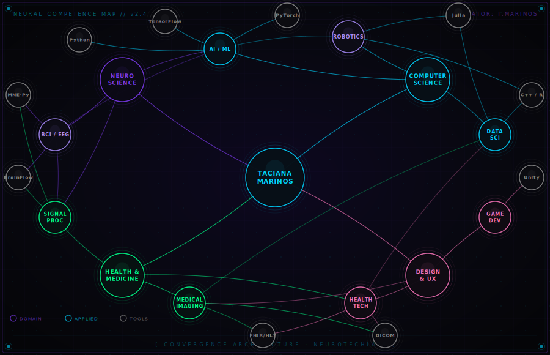
</p>

---

<!-- ═══════════════════════════════════════════════════════
     NEURAL STACK — ANIMATED BADGES
════════════════════════════════════════════════════════ -->

## `> NEURAL STACK`

```
SYSTEM: LOADING COMPETENCE MODULES...
```

**⬡ LANGUAGES & CORE**

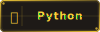&nbsp;
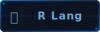&nbsp;
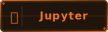&nbsp;
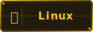&nbsp;

<br/>

**⬡ AI / ML ENGINE**

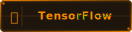&nbsp;
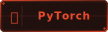&nbsp;
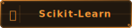&nbsp;
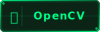&nbsp;

<br/>

**⬡ NEUROTECH / BCI**

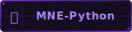&nbsp;
&nbsp;
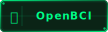&nbsp;

<br/>

**⬡ HEALTH TECH**

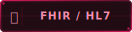&nbsp;

<br/>

**⬡ FULL STACK & INFRA**

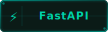&nbsp;
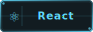&nbsp;
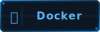&nbsp;

<br/>

**⬡ SIMULATION & DESIGN**

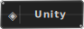&nbsp;

<br/>

---

<!-- ═══════════════════════════════════════════════════════
     ACTIVE PROJECTS
════════════════════════════════════════════════════════ -->

## `> ACTIVE PROJECTS`

```
ls -la ./projects/
```

```
┌─ PROJECT_001 ──────────────────────────────────────────────────────┐
│  NEUROSYNC                                                          │
│  EEG-based neural feedback system for dental anxiety reduction      │
│  STACK: Python · BrainFlow · TensorFlow · Signal Processing         │
└────────────────────────────────────────────────────────────────────┘

┌─ PROJECT_002 ──────────────────────────────────────────────────────┐
│  DENTALAI VISION                                                    │
│  Deep learning model for dental X-ray pathology detection           │
│  STACK: PyTorch · DICOM · ResNet · Computer Vision                  │
└────────────────────────────────────────────────────────────────────┘

┌─ PROJECT_003 ──────────────────────────────────────────────────────┐
│  BCI GAME THERAPY                                                   │
│  Brain-Computer Interface for neurological rehabilitation via games │
│  STACK: Unity · OpenBCI · C# · Reinforcement Learning              │
└────────────────────────────────────────────────────────────────────┘

┌─ PROJECT_004 ──────────────────────────────────────────────────────┐
│  NEUROTECHLABS PLATFORM                                             │
│  Open-source hub for human-machine interface research               │
│  STACK: Python · FastAPI · Docker · React                          │
└────────────────────────────────────────────────────────────────────┘
```

---

<!-- ═══════════════════════════════════════════════════════
     NEURAL METRICS — GITHUB STATS
════════════════════════════════════════════════════════ -->

## `> NEURAL METRICS`

<p align="center">
  
  &nbsp;&nbsp;
  
</p>

<p align="center">
  
</p>

---

<!-- ═══════════════════════════════════════════════════════
     CURRENT PROTOCOLS
════════════════════════════════════════════════════════ -->

## `> CURRENT PROTOCOLS`

```python
class TacianaMarinos:

    ACTIVE   = "Neural interfaces for dental pain management"
    LEARNING = ["Advanced ML", "Reinforcement Learning", "Surgical Robotics"]
    OPEN_TO  = ["Research collaborations", "NeuroTech projects", "Health AI"]
    ASK_ME   = ["BCI", "AI in Dentistry", "HCI", "Game Design in Health"]

    def mission(self) -> str:
        return "Bridging the gap between human biology and intelligent machines."
```

---

<!-- ═══════════════════════════════════════════════════════
     CONNECT
════════════════════════════════════════════════════════ -->

## `> CONNECT`

```
ESTABLISHING SECURE CONNECTION...
```

<p align="center">
  <a href="https://www.linkedin.com/in/taciana-marinos-ramalho-04028373" target="_blank">
    
  </a>
  &nbsp;
  <a href="mailto:taciana@neurotechlabs.io">
    
  </a>
  &nbsp;
  
</p>

---

<!-- ═══════════════════════════════════════════════════════
     FOOTER
════════════════════════════════════════════════════════ -->

```
╔══════════════════════════════════════════════════════════════════╗
║                                                                  ║
║   "The future of medicine is written in code.                    ║
║    I am writing it."                                             ║
║                          — Taciana Marinos                       ║
║                                                                  ║
║   NEUROTECHLABS // SESSION TERMINATED ░░░░░░░░░░░░░░░░░░░░░░░░  ║
╚══════════════════════════════════════════════════════════════════╝
```

<p align="center">
  
</p>

<!-- NEUROTECHLABS // EOF -->